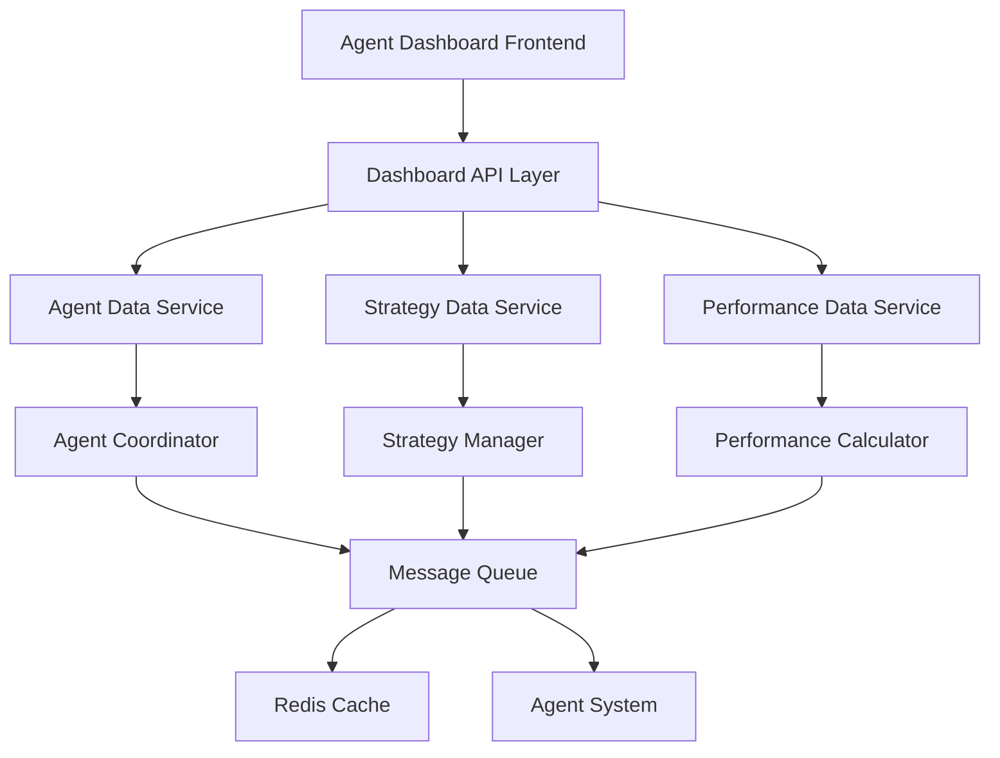

# Agent仪表板设计文档

## Overview

Agent仪表板是一个基于Web的实时监控界面，为港股量化交易AI Agent系统提供全面的可视化监控能力。该仪表板将展示每个Agent的详细工作状态、交易策略信息、绩效指标（包括夏普比率）和实时操作控制功能，帮助项目团队优化交易策略和提升系统整体性能。

## Steering Document Alignment

### Technical Standards (tech.md)
设计遵循现有的技术标准和架构模式：
- 使用FastAPI作为Web框架，与现有监控仪表板保持一致
- 采用WebSocket实现实时数据推送
- 使用Pydantic进行数据验证和序列化
- 遵循微服务架构和事件驱动设计模式

### Project Structure (structure.md)
实现将遵循现有的项目组织结构：
- 在`src/dashboard/`目录下创建仪表板相关组件
- 复用现有的数据模型和Agent状态管理
- 与现有的消息队列系统集成
- 保持与现有监控仪表板的兼容性

## Code Reuse Analysis

### Existing Components to Leverage
- **MonitoringDashboard**: 扩展现有的性能监控仪表板，添加Agent特定功能
- **AgentCoordinator**: 复用Agent状态管理和健康监控功能
- **MessageQueue**: 利用现有的消息队列系统进行实时数据推送
- **BaseAgent**: 复用Agent状态和统计信息收集机制
- **AgentInfo/SystemMetrics**: 扩展现有的数据模型以包含交易策略信息

### Integration Points
- **现有监控系统**: 集成到现有的性能监控仪表板中
- **Agent系统**: 通过消息队列与所有Agent进行通信
- **数据存储**: 利用现有的Redis缓存和历史数据存储
- **WebSocket连接**: 复用现有的实时数据推送机制

## Architecture

Agent仪表板采用分层架构设计，包含数据层、服务层、API层和表示层，确保模块化和可扩展性。

### Modular Design Principles
- **Single File Responsibility**: 每个文件处理特定的功能域（Agent状态、策略信息、绩效指标）
- **Component Isolation**: 创建独立可复用的Agent卡片组件和指标展示组件
- **Service Layer Separation**: 分离数据获取、业务逻辑和UI展示层
- **Utility Modularity**: 将通用功能（数据格式化、图表生成）分解为独立模块



## Components and Interfaces

### AgentDashboardComponent
- **Purpose:** 主要的仪表板组件，展示所有Agent的状态和关键指标
- **Interfaces:** `get_agent_status()`, `update_agent_display()`, `handle_agent_action()`
- **Dependencies:** AgentDataService, WebSocketManager
- **Reuses:** 现有的MonitoringDashboard HTML模板和样式

### AgentCardComponent
- **Purpose:** 单个Agent的状态卡片，显示Agent基本信息、状态和快速操作
- **Interfaces:** `render_agent_card()`, `update_status()`, `handle_click()`
- **Dependencies:** AgentInfo数据模型
- **Reuses:** 现有的指标卡片样式和状态指示器

### StrategyDisplayComponent
- **Purpose:** 展示Agent的交易策略详情和参数
- **Interfaces:** `show_strategy_details()`, `update_strategy_info()`, `render_strategy_chart()`
- **Dependencies:** StrategyDataService
- **Reuses:** 现有的图表渲染功能和数据可视化组件

### PerformanceMetricsComponent
- **Purpose:** 显示Agent的绩效指标，包括夏普比率、收益、回撤等
- **Interfaces:** `calculate_metrics()`, `render_metrics_chart()`, `update_performance_display()`
- **Dependencies:** PerformanceCalculator, HistoricalDataService
- **Reuses:** 现有的图表库和指标计算逻辑

### AgentControlComponent
- **Purpose:** 提供Agent控制功能（启动、停止、重启、参数调整）
- **Interfaces:** `start_agent()`, `stop_agent()`, `restart_agent()`, `update_parameters()`
- **Dependencies:** AgentCoordinator, MessageQueue
- **Reuses:** 现有的Agent控制逻辑和确认对话框

## Data Models

### AgentDashboardData
```
- agent_id: string
- agent_type: string
- status: AgentStatus
- last_heartbeat: datetime
- current_strategy: StrategyInfo
- performance_metrics: PerformanceMetrics
- system_resources: ResourceUsage
- control_actions: List[ControlAction]
```

### StrategyInfo
```
- strategy_name: string
- strategy_type: string
- parameters: Dict[string, any]
- backtest_results: BacktestMetrics
- live_performance: LiveMetrics
- last_updated: datetime
- version: string
```

### PerformanceMetrics
```
- sharpe_ratio: float
- total_return: float
- max_drawdown: float
- volatility: float
- win_rate: float
- profit_factor: float
- trades_count: int
- calculation_date: datetime
```

### AgentControlAction
```
- action_id: string
- agent_id: string
- action_type: string
- parameters: Dict[string, any]
- status: ActionStatus
- created_at: datetime
- executed_at: datetime
- result: ActionResult
```

## Error Handling

### Error Scenarios
1. **Agent连接失败**
   - **Handling:** 显示离线状态，提供重连按钮，记录错误日志
   - **User Impact:** 用户看到Agent离线指示，可以尝试重新连接

2. **数据获取超时**
   - **Handling:** 显示缓存数据，显示"数据可能不是最新"提示
   - **User Impact:** 用户看到稍旧的数据，但有明确的提示信息

3. **Agent控制操作失败**
   - **Handling:** 显示操作失败消息，提供重试选项，记录详细错误
   - **User Impact:** 用户收到明确的失败反馈，可以重新尝试操作

4. **WebSocket连接中断**
   - **Handling:** 自动重连机制，显示连接状态，降级到轮询模式
   - **User Impact:** 用户可能看到短暂的数据更新延迟，但系统会自动恢复

## Testing Strategy

### Unit Testing
- 测试每个组件的数据处理和渲染逻辑
- 验证Agent状态更新和策略信息显示
- 测试绩效指标计算和图表生成

### Integration Testing
- 测试与现有Agent系统的集成
- 验证消息队列通信和WebSocket连接
- 测试Agent控制操作的端到端流程

### End-to-End Testing
- 测试完整的用户交互流程
- 验证实时数据更新和Agent状态变化
- 测试多用户并发访问场景
