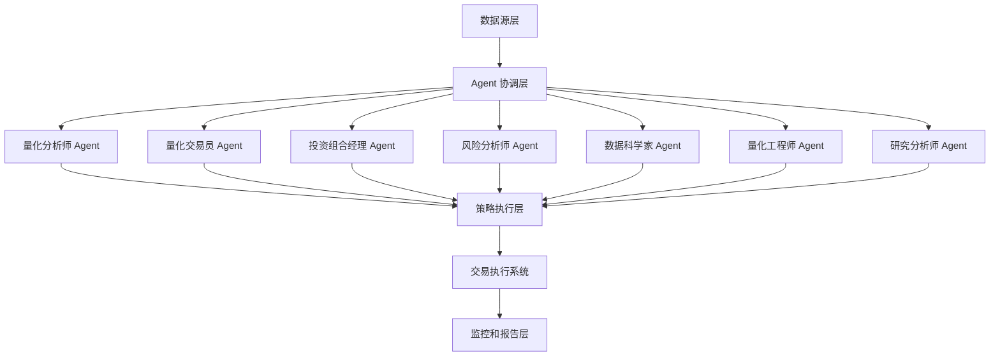

# Design Document

## Overview

港股量化交易 AI Agent 系统是一个基于微服务架构的分布式交易平台，由 7 个专门的 AI Agent 组成，旨在实现高 Sharpe 比率的交易策略。系统采用事件驱动的架构模式，支持实时数据处理、智能决策制定和自动化交易执行。

## Steering Document Alignment

### Technical Standards (tech.md)
系统遵循现代微服务架构最佳实践，使用 Python 作为主要开发语言，采用异步编程模式，确保高并发和低延迟的交易执行能力。

### Project Structure (structure.md)
项目采用分层架构设计，包含 Agent 层、服务层、数据层和基础设施层，确保代码的可维护性和可扩展性。

## Code Reuse Analysis

### Existing Components to Leverage
- **现有量化分析框架**: 基于已有的港股量化分析系统进行扩展
- **数据处理器**: 复用现有的数据清洗和预处理模块
- **可视化组件**: 利用现有的图表和仪表板组件

### Integration Points
- **港股数据源**: 集成现有的实时数据馈送系统
- **交易执行系统**: 连接现有的订单管理系统
- **风险管理模块**: 集成现有的风险计算和控制组件

## Architecture

### Modular Design Principles
- **Single File Responsibility**: 每个 Agent 对应独立的模块文件
- **Component Isolation**: Agent 之间通过消息队列进行解耦通信
- **Service Layer Separation**: 数据访问、业务逻辑和交易执行分层处理
- **Utility Modularity**: 共享工具和算法库模块化设计



## Components and Interfaces

### Agent 协调器 (Agent Coordinator)
- **Purpose:** 管理所有 Agent 的生命周期和通信协调
- **Interfaces:** 
  - `start_agent(agent_type, config)`: 启动指定类型的 Agent
  - `stop_agent(agent_id)`: 停止指定 Agent
  - `broadcast_message(message)`: 向所有 Agent 广播消息
- **Dependencies:** 消息队列系统、配置管理服务
- **Reuses:** 现有的服务管理框架

### 量化分析师 Agent
- **Purpose:** 开发数学模型、进行回测分析、预测市场波动
- **Interfaces:**
  - `analyze_market_data(data)`: 分析市场数据
  - `backtest_strategy(strategy, period)`: 策略回测
  - `predict_volatility(indicators)`: 预测市场波动
- **Dependencies:** 数据存储、统计分析库、回测引擎
- **Reuses:** 现有的技术指标计算模块

### 量化交易员 Agent
- **Purpose:** 识别交易机会、执行买卖订单、优化交易策略
- **Interfaces:**
  - `detect_signals(market_data)`: 检测交易信号
  - `execute_trade(order)`: 执行交易订单
  - `optimize_strategy(performance_data)`: 优化交易策略
- **Dependencies:** 实时数据流、订单管理系统
- **Reuses:** 现有的信号检测算法

### 投资组合经理 Agent
- **Purpose:** 构建投资组合、管理资产配置、控制风险暴露
- **Interfaces:**
  - `construct_portfolio(assets, constraints)`: 构建投资组合
  - `rebalance_portfolio(current_holdings, target_weights)`: 重新平衡投资组合
  - `monitor_performance(portfolio_data)`: 监控投资组合表现
- **Dependencies:** 资产定价服务、风险计算引擎
- **Reuses:** 现有的投资组合优化算法

### 风险分析师 Agent
- **Purpose:** 计算风险指标、设计对冲策略、进行压力测试
- **Interfaces:**
  - `calculate_var(portfolio, confidence_level)`: 计算 VaR 风险指标
  - `stress_test(scenarios)`: 进行压力测试
  - `design_hedge_strategy(risk_exposure)`: 设计对冲策略
- **Dependencies:** 历史数据、蒙特卡洛模拟引擎
- **Reuses:** 现有的风险计算模型

### 数据科学家 Agent
- **Purpose:** 机器学习预测、数据挖掘、异常检测
- **Interfaces:**
  - `train_model(training_data, model_type)`: 训练机器学习模型
  - `predict_trends(features)`: 预测股票趋势
  - `detect_anomalies(data_stream)`: 检测异常模式
- **Dependencies:** 机器学习框架、特征工程库
- **Reuses:** 现有的数据预处理管道

### 量化工程师 Agent
- **Purpose:** 系统开发、部署、监控、性能优化
- **Interfaces:**
  - `deploy_system(components)`: 部署系统组件
  - `monitor_performance(metrics)`: 监控系统性能
  - `optimize_system(bottlenecks)`: 优化系统性能
- **Dependencies:** 容器编排平台、监控系统
- **Reuses:** 现有的 DevOps 工具链

### 研究分析师 Agent
- **Purpose:** 量化研究、策略开发、学术文献分析
- **Interfaces:**
  - `analyze_research_papers(query)`: 分析学术文献
  - `test_hypothesis(hypothesis, data)`: 测试交易假设
  - `develop_strategy(research_findings)`: 开发新策略
- **Dependencies:** 学术数据库、回测框架
- **Reuses:** 现有的文献处理工具

## Data Models

### Market Data Model
```
MarketData:
- symbol: string (股票代码)
- timestamp: datetime (时间戳)
- open_price: float (开盘价)
- high_price: float (最高价)
- low_price: float (最低价)
- close_price: float (收盘价)
- volume: int (成交量)
- market_cap: float (市值)
- pe_ratio: float (市盈率)
```

### Trading Signal Model
```
TradingSignal:
- signal_id: string (信号ID)
- symbol: string (股票代码)
- signal_type: enum (BUY/SELL/HOLD)
- confidence_score: float (置信度 0-1)
- timestamp: datetime (生成时间)
- reasoning: string (决策理由)
- target_price: float (目标价格)
- stop_loss: float (止损价格)
```

### Portfolio Model
```
Portfolio:
- portfolio_id: string (投资组合ID)
- name: string (投资组合名称)
- total_value: float (总价值)
- cash_balance: float (现金余额)
- holdings: List[Holding] (持仓列表)
- risk_metrics: RiskMetrics (风险指标)
- performance_metrics: PerformanceMetrics (绩效指标)
```

### Risk Metrics Model
```
RiskMetrics:
- portfolio_id: string (投资组合ID)
- var_95: float (95% VaR)
- var_99: float (99% VaR)
- expected_shortfall: float (期望损失)
- sharpe_ratio: float (夏普比率)
- max_drawdown: float (最大回撤)
- volatility: float (波动率)
- beta: float (贝塔系数)
```

## Error Handling

### Error Scenarios
1. **数据源连接失败**
   - **Handling:** 自动切换到备用数据源，记录错误日志
   - **User Impact:** 系统继续运行，可能使用延迟数据

2. **Agent 通信超时**
   - **Handling:** 重新发送消息，如果多次失败则重启 Agent
   - **User Impact:** 短暂的服务中断，自动恢复

3. **交易执行失败**
   - **Handling:** 取消订单，通知风险管理系统，记录失败原因
   - **User Impact:** 交易未执行，系统发送通知

4. **风险指标计算异常**
   - **Handling:** 使用历史数据重新计算，触发风险预警
   - **User Impact:** 风险监控面板显示异常状态

## Testing Strategy

### Unit Testing
- 每个 Agent 的核心算法和接口测试
- 数据模型的验证和序列化测试
- 工具函数的边界条件测试

### Integration Testing
- Agent 间的消息传递测试
- 数据流管道端到端测试
- 交易执行流程集成测试

### End-to-End Testing
- 完整交易策略的端到端验证
- 风险控制流程的完整测试
- 系统故障恢复能力测试
