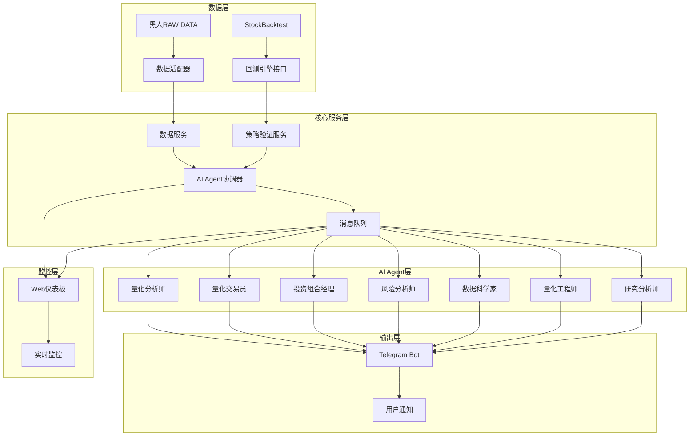

# 真实系统集成设计文档

## 概述

本设计文档描述了如何将现有的港股量化交易AI Agent演示系统扩展为真实可用的生产级系统。该系统将集成三个现有项目：StockBacktest回测引擎、黑人RAW DATA数据源和CURSOR CLI Telegram Bot，创建一个完整的量化交易解决方案。

## 指导文档对齐

### 技术标准 (tech.md)
设计遵循现有的微服务架构模式、事件驱动通信和模块化设计原则，确保系统的高可用性、可扩展性和可维护性。

### 项目结构 (structure.md)
实现将遵循现有的分层架构：核心层(src/core)、代理层(src/agents)、数据层(src/models)、服务层(src/services)和仪表板层(src/dashboard)。

## 代码重用分析

### 现有组件利用
- **AI Agent架构**: 扩展现有的7个AI Agent，从模拟数据转向真实数据驱动
- **消息队列系统**: 重用现有的Redis消息队列进行Agent间通信
- **仪表板框架**: 扩展现有的Web仪表板，集成真实数据展示
- **数据模型**: 重用现有的Pydantic数据模型，扩展支持真实数据格式
- **监控系统**: 重用现有的性能监控和告警系统

### 集成点
- **StockBacktest项目**: 集成回测引擎作为策略验证和绩效计算的核心
- **黑人RAW DATA项目**: 作为主要数据源，提供实时和历史市场数据
- **CURSOR CLI项目**: 集成Telegram Bot作为用户交互和信号输出接口
- **现有数据库**: 扩展现有数据模型以支持真实交易数据

## 架构

### 系统架构图



### 模块化设计原则
- **单一文件职责**: 每个文件专注于特定的数据源、Agent功能或服务
- **组件隔离**: 创建小型、专注的组件，避免大型单体文件
- **服务层分离**: 分离数据访问、业务逻辑和展示层
- **工具模块化**: 将工具分解为专注的、单一用途的模块

## 组件和接口

### 数据适配器组件
- **目的**: 将黑人RAW DATA项目的原始数据转换为系统标准格式
- **接口**: `DataAdapter.get_market_data()`, `DataAdapter.validate_data()`, `DataAdapter.transform_data()`
- **依赖**: 黑人RAW DATA项目的数据文件格式
- **重用**: 现有的数据模型和验证框架

### 回测引擎接口组件
- **目的**: 集成StockBacktest项目的回测功能
- **接口**: `BacktestInterface.run_backtest()`, `BacktestInterface.get_performance()`, `BacktestInterface.validate_strategy()`
- **依赖**: StockBacktest项目的核心回测引擎
- **重用**: 现有的策略管理和绩效计算框架

### 真实AI Agent组件
- **目的**: 将模拟AI Agent转换为基于真实数据的智能代理
- **接口**: `RealAgent.analyze_market_data()`, `RealAgent.generate_signals()`, `RealAgent.manage_risk()`
- **依赖**: 真实市场数据和机器学习模型
- **重用**: 现有的Agent基础架构和消息通信系统

### Telegram Bot集成组件
- **目的**: 集成CURSOR CLI项目的Telegram Bot功能
- **接口**: `TelegramInterface.send_signal()`, `TelegramInterface.send_alert()`, `TelegramInterface.handle_command()`
- **依赖**: CURSOR CLI项目的Bot实现
- **重用**: 现有的消息格式和用户交互模式

### 实时监控组件
- **目的**: 监控系统性能和交易风险
- **接口**: `Monitor.check_system_health()`, `Monitor.detect_anomalies()`, `Monitor.send_alerts()`
- **依赖**: 系统性能指标和交易数据
- **重用**: 现有的监控框架和告警系统

## 数据模型

### 真实市场数据模型
```
RealMarketData:
- symbol: string (股票代码)
- timestamp: datetime (数据时间戳)
- open_price: decimal (开盘价)
- high_price: decimal (最高价)
- low_price: decimal (最低价)
- close_price: decimal (收盘价)
- volume: integer (成交量)
- market_cap: decimal (市值)
- pe_ratio: decimal (市盈率)
- data_source: string (数据源标识)
- quality_score: float (数据质量评分)
```

### 策略绩效模型
```
StrategyPerformance:
- strategy_id: string (策略ID)
- backtest_period: string (回测期间)
- sharpe_ratio: decimal (夏普比率)
- total_return: decimal (总收益率)
- max_drawdown: decimal (最大回撤)
- win_rate: decimal (胜率)
- volatility: decimal (波动率)
- trades_count: integer (交易次数)
- last_updated: datetime (最后更新时间)
- validation_status: string (验证状态)
```

### 交易信号模型
```
TradingSignal:
- signal_id: string (信号ID)
- agent_id: string (生成信号的Agent)
- symbol: string (股票代码)
- signal_type: string (信号类型: buy/sell/hold)
- confidence: float (信号置信度)
- target_price: decimal (目标价格)
- stop_loss: decimal (止损价格)
- timestamp: datetime (信号生成时间)
- metadata: dict (附加元数据)
```

### Telegram消息模型
```
TelegramMessage:
- message_type: string (消息类型: signal/alert/status)
- recipient_id: string (接收者ID)
- content: string (消息内容)
- priority: string (优先级: high/medium/low)
- timestamp: datetime (发送时间)
- delivery_status: string (发送状态)
```

## 错误处理

### 错误场景
1. **数据源连接失败**
   - **处理**: 自动切换到备用数据源，记录错误日志，发送告警通知
   - **用户影响**: 用户收到数据源切换通知，系统继续正常运行

2. **回测引擎异常**
   - **处理**: 暂停策略验证，使用历史绩效数据，触发人工检查
   - **用户影响**: 用户收到回测异常告警，策略使用缓存数据

3. **AI Agent故障**
   - **处理**: 自动重启故障Agent，切换到备用分析模式
   - **用户影响**: 用户收到Agent故障通知，系统降级运行

4. **Telegram Bot发送失败**
   - **处理**: 重试发送机制，记录失败消息，使用备用通知方式
   - **用户影响**: 用户可能延迟收到通知，但不会丢失重要信息

5. **数据质量问题**
   - **处理**: 数据清洗和验证，标记低质量数据，使用插值或历史数据
   - **用户影响**: 用户收到数据质量告警，系统使用备用数据源

## 测试策略

### 单元测试
- 数据适配器的数据转换逻辑测试
- AI Agent的核心分析算法测试
- Telegram Bot的消息处理逻辑测试
- 回测引擎接口的集成测试

### 集成测试
- 数据源到AI Agent的完整数据流测试
- AI Agent到Telegram Bot的信号传输测试
- 回测引擎与策略验证的集成测试
- 错误恢复和故障切换测试

### 端到端测试
- 从市场数据接收到用户通知的完整流程测试
- 多Agent协作的复杂场景测试
- 高负载下的系统性能测试
- 真实市场数据的处理能力测试
