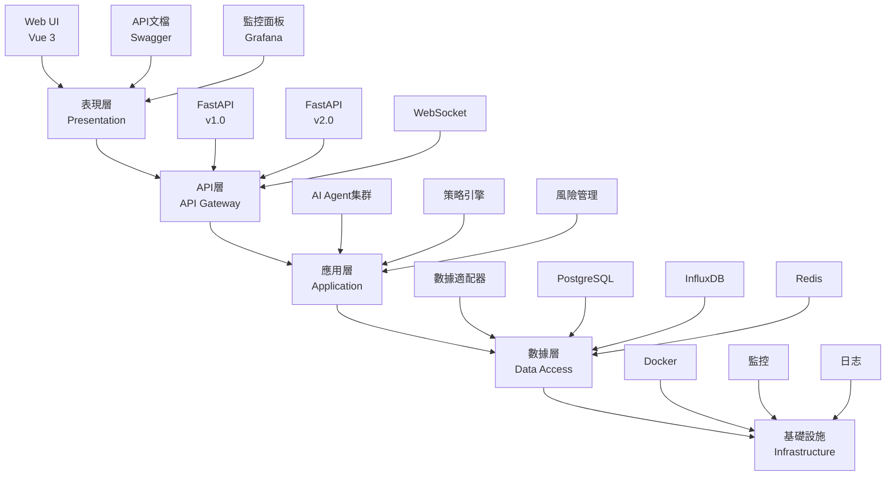

# Mini Hedge Fund 新開發者入門指南

**版本**: v1.0
**創建日期**: 2025年11月5日
**適用對象**: 新加入Mini Hedge Fund團隊的開發者
**完成時間預估**: 2-4小時

---

## 歡迎！

歡迎加入Mini Hedge Fund團隊！本指南將幫助您快速了解項目、熟悉開發環境，並開始您的第一次貢獻。

**預計閱讀時間**: 30分鐘
**完成環境設置**: 30分鐘
**第一次提交**: 1-2小時

---

## 目錄

1. [項目概述](#項目概述)
2. [架構概覽](#架構概覽)
3. [開發環境](#開發環境)
4. [代碼結構](#代碼結構)
5. [開發工作流](#開發工作流)
6. [核心概念](#核心概念)
7. [第一個任務](#第一個任務)
8. [常見問題](#常見問題)

---

## 項目概述

### Mini Hedge Fund是什麼？

Mini Hedge Fund是一個基於**35個宏觀指標**的港股量化交易系統，採用**5層架構**設計，整合了多個數據源和AI智能體。

### 核心特性

- **📊 35個宏觀指標**: HIBOR利率、GDP、零售數據、訪客數據等
- **🏗️ 5層架構**: 表現層 → API層 → 應用層 → 數據層 → 基礎設施
- **🤖 7個AI智能體**: 協調員、數據科學家、量化分析師等
- **⚡ 3大策略引擎**: 動能策略、均值回歸、多空對沖
- **📈 實時風險管理**: VaR計算、最大回撤監控
- **📊 績效分析**: 實時計算、策略歸因

### Sprint規劃

我們採用**Scrum敏捷開發**方法，2週一個Sprint：

- **Sprint 0**: 基礎設施與數據層 ✅ (當前)
- **Sprint 1**: 指標轉換與分析
- **Sprint 2**: 宏觀振盪器
- **Sprint 3-4**: 策略引擎集群
- **Sprint 5-6**: 風險與組合管理
- **Sprint 7-8**: 績效分析與報告

---

## 架構概覽

### 5層架構



### 數據流


---

## 開發環境

### 環境要求

| 軟件 | 版本 | 用途 |
|------|------|------|
| Python | 3.10+ | 開發語言 |
| Docker | 24.0+ | 容器化 |
| Git | 2.30+ | 版本控制 |
| VS Code | 最新 | IDE (推薦) |

### 快速設置

1. **克隆項目**
```bash
git clone <repository-url>
cd CODEX--
```

2. **運行環境驗證**
```bash
# Linux/macOS
./verify-env.sh

# Windows
verify-env.bat
```

3. **啟動系統**
```bash
docker-compose up -d
python complete_project_system.py
```

**完整指南**: [開發環境設置](development-setup-sprint0.md)

### IDE配置

#### VS Code (推薦)

安裝擴展：
- Python
- Pylance
- Python Debugger
- Docker
- GitLens

推薦設置：
```json
{
    "python.defaultInterpreterPath": "./.venv310/bin/python",
    "python.linting.enabled": true,
    "python.linting.flake8Enabled": true,
    "python.linting.mypyEnabled": true,
    "python.formatting.provider": "black",
    "editor.formatOnSave": true,
    "editor.codeActionsOnSave": {
        "source.organizeImports": true
    }
}
```

---

## 代碼結構

### 根目錄結構

```
CODEX--/
├── src/                    # 源代碼
│   ├── agents/            # AI智能體 (7個)
│   ├── data_adapters/     # 數據適配器
│   ├── dashboard/         # API服務
│   ├── backtest/          # 回測引擎
│   ├── monitoring/        # 監控系統
│   └── risk_management/   # 風險管理
├── docs/                  # 文檔
├── tests/                 # 測試代碼
├── scripts/               # 腳本工具
├── docker-compose.yml     # Docker編排
├── requirements.txt       # Python依賴
├── pyproject.toml         # 項目配置
└── README.md             # 項目說明
```

### 關鍵目錄詳解

#### src/agents/ - AI智能體

```python
# 7個專業智能體
agents/
├── coordinator.py         # 協調員 - 協調所有Agent工作
├── data_scientist.py      # 數據科學家 - 數據分析和異常檢測
├── quantitative_analyst.py # 量化分析師 - 量化分析和蒙特卡洛模擬
├── quantitative_engineer.py # 量化工程師 - 系統監控和性能優化
├── portfolio_manager.py   # 投資組合經理 - 組合管理和風險預算
├── research_analyst.py    # 研究分析師 - 策略研究和回測驗證
└── risk_analyst.py       # 風險分析師 - 風險評估和對沖策略
```

**使用示例**:
```python
from src.agents.coordinator import Coordinator

coordinator = Coordinator()
await coordinator.start()
```

#### src/data_adapters/ - 數據適配器

```python
# 數據適配器 - 統一的數據接口
data_adapters/
├── base_adapter.py        # 基礎適配器
├── http_api_adapter.py    # HTTP API適配器
├── yahoo_finance_adapter.py # Yahoo Finance
├── alpha_vantage_adapter.py # Alpha Vantage
└── hkma_adapter.py       # HKMA適配器 (Sprint 0)
```

**設計模式**: 策略模式 + 工廠模式

**使用示例**:
```python
from src.data_adapters.yahoo_finance_adapter import YahooFinanceAdapter

adapter = YahooFinanceAdapter()
data = await adapter.fetch_data("0700.HK", "2020-01-01", "2023-01-01")
```

#### src/dashboard/ - API服務

```python
# FastAPI Web服務
dashboard/
├── api_routes.py          # API路由
├── websocket_manager.py   # WebSocket管理
├── agent_control.py       # Agent控制
└── performance_service.py # 性能監控
```

**API端點示例**:
```bash
GET /api/health            # 健康檢查
GET /api/market/{symbol}   # 獲取市場數據
GET /api/macro/indicators  # 獲取宏觀指標 (Sprint 0)
GET /api/strategies/signals # 獲取策略信號
```

---

## 開發工作流

### Git工作流

我們使用**Git Flow**工作流：

```bash
# 1. 創建功能分支
git checkout -b feature/US-XXX-description

# 2. 開發和提交
git add .
git commit -m "feat: add feature description (#US-XXX)"

# 3. 推送分支
git push origin feature/US-XXX-description

# 4. 創建Pull Request
# 在GitHub/GitLab上創建PR

# 5. 代碼審查
# 同事審查代碼

# 6. 合併到主分支
git checkout main
git pull origin main
git merge feature/US-XXX-description
```

### 提交規範

使用**Conventional Commits**格式：

```
<type>[optional scope]: <description>

[optional body]

[optional footer(s)]
```

**類型**:
- `feat`: 新功能
- `fix`: 修復bug
- `docs`: 文檔更新
- `style`: 代碼格式調整
- `refactor`: 重構
- `test`: 測試
- `chore`: 構建流程或輔助工具變動

**示例**:
```bash
git commit -m "feat: add HKMA data adapter (#US-004)"
git commit -m "fix: resolve InfluxDB connection timeout"
git commit -m "docs: update API documentation"
```

### 代碼質量檢查

**自動檢查** (Pre-commit):
```bash
# 代碼格式化
black src/ tests/

# Import排序
isort src/ tests/

# 代碼檢查
flake8 src/ tests/

# 類型檢查
mypy src/

# 安全檢查
bandit -r src/
```

**提交前檢查清單**:
- [ ] 代碼格式化 (black, isort)
- [ ] 通過flake8檢查
- [ ] 通過mypy檢查
- [ ] 所有測試通過
- [ ] 測試覆蓋率 > 80%
- [ ] 提交信息符合規範

---

## 核心概念

### 1. 宏觀指標 (Macro Indicators)

**35個指標分類**:

| 類別 | 數量 | 指標示例 |
|------|------|----------|
| HIBOR利率 | 5 | overnight, 1m, 3m, 6m, 12m |
| 房地產市場 | 5 | 房價, 租金, 回報率, 交易量, 交易額 |
| GDP經濟數據 | 5 | 總量, 增長率, 三大產業結構 |
| 零售銷售 | 6 | 總銷售, 各品類銷售, 同比增長 |
| 訪客數據 | 3 | 總訪客, 大陸訪客, 增長率 |
| 貿易數據 | 3 | 出口, 進口, 貿易餘額 |
| 交通數據 | 3 | 交通流量, 平均車速, 擁堵指數 |
| MTR數據 | 2 | 日均乘客, 尖峰時段乘客 |
| 邊境數據 | 3 | 居民入境, 訪客入境, 居民出境 |

**指標接口**:
```python
class MacroIndicator(BaseModel):
    timestamp: datetime
    indicator_name: str
    value: float
    zscore: Optional[float] = None
    technical_score: Optional[float] = None
    source: str
    quality_score: float
```

### 2. 宏觀振盪器 (Macro Oscillator)

將35個指標整合為**0-1之間**的振盪器值：

```python
class MacroOscillator:
    """宏觀振盪器 - 市場狀態評估"""

    def calculate(self, indicators: Dict[str, float]) -> dict:
        """
        計算宏觀振盪器值

        Args:
            indicators: 35個指標字典

        Returns:
            {
                'oscillator': 0.65,  # 振盪器值 (0-1)
                'market_regime': 'BULL',  # BULL/BEAR/SIDEWAYS
                'confidence': 0.85  # 置信度
            }
        """
        pass
```

**市場狀態**:
- `BULL`: 振盪器 > 0.65 (看漲)
- `BEAR`: 振盪器 < 0.35 (看跌)
- `SIDEWAYS`: 0.35 ≤ 振盪器 ≤ 0.65 (橫盤)

### 3. 策略引擎

#### 動能策略 (40%基礎權重)

```python
class MomentumStrategy:
    """動能策略 - 趨勢跟隨"""

    def generate_signal(self, data: MarketData) -> TradingSignal:
        """生成交易信號"""
        # 1. 計算綜合動量
        momentum = self.calculate_momentum(data)

        # 2. 趨勢確認
        trend = self.confirm_trend(data)

        # 3. 生成信號
        if momentum > 0.6 and trend == 'UP':
            return TradingSignal(
                action='BUY',
                confidence=0.75,
                position_size=0.4
            )
```

#### 均值回歸策略 (35%基礎權重)

```python
class MeanReversionStrategy:
    """均值回歸策略 - 極端值反轉"""

    def generate_signal(self, data: MarketData) -> TradingSignal:
        """生成交易信號"""
        # 1. 檢測極端值
        zscore = self.calculate_zscore(data)

        # 2. 計算回歸概率
        probability = self.calculate_reversion_probability(zscore)

        # 3. 生成信號
        if zscore > 2.5 and probability > 0.7:
            return TradingSignal(
                action='SELL',
                confidence=0.80,
                position_size=0.35
            )
```

### 4. 風險管理

#### VaR計算

```python
class RiskManager:
    """風險管理器"""

    def calculate_var(self, portfolio: Portfolio, confidence: float = 0.95) -> float:
        """
        計算風險價值 (VaR)

        Args:
            portfolio: 投資組合
            confidence: 置信度 (95%)

        Returns:
            VaR值
        """
        pass

    def check_risk_limits(self, portfolio: Portfolio) -> dict:
        """檢查風險限制"""
        return {
            'var': self.calculate_var(portfolio),
            'max_drawdown': self.calculate_max_drawdown(portfolio),
            'volatility': self.calculate_volatility(portfolio),
            'breach': False
        }
```

### 5. AI智能體通信

Agent通過**消息隊列**進行通信：

```python
# 發送消息
await self.broadcast_message(
    message_type="SIGNAL",
    content={
        "symbol": "0700.HK",
        "action": "BUY",
        "confidence": 0.75
    },
    recipient="portfolio_manager"
)

# 接收消息
async def process_message(self, message: Message) -> bool:
    if message.type == "SIGNAL":
        await self.handle_trading_signal(message.content)
    return True
```

---

## 第一個任務

### 建議任務列表

#### 初學者任務

1. **熟悉環境** (30分鐘)
   - [ ] 完成開發環境設置
   - [ ] 運行測試套件
   - [ ] 查看API文檔

2. **查看代碼** (60分鐘)
   - [ ] 閱讀Agent基類 (`src/agents/base_agent.py`)
   - [ ] 閱讀數據適配器 (`src/data_adapters/base_adapter.py`)
   - [ ] 閱讀API路由 (`src/dashboard/api_routes.py`)

3. **小修改** (30分鐘)
   - [ ] 添加一個簡單的API端點
   - [ ] 運行測試確保通過

#### 中級任務

4. **實現功能** (2-4小時)
   - [ ] 實現一個新的宏觀指標適配器
   - [ ] 編寫相應的測試
   - [ ] 確保代碼覆蓋率 > 80%

5. **代碼重構** (1-2小時)
   - [ ] 重構現有代碼提高可讀性
   - [ ] 添加類型註釋
   - [ ] 優化性能

### 具體實踐：添加一個簡單API端點

**任務**: 添加一個返回系統版本的API端點

**步驟**:

1. **編輯API路由**
```python
# src/dashboard/api_routes.py

from fastapi import APIRouter

router = APIRouter()

@router.get("/api/version")
async def get_version():
    """獲取系統版本信息"""
    return {
        "version": "2.0.0",
        "sprint": "Sprint 0",
        "build_date": "2025-11-05"
    }
```

2. **添加測試**
```python
# tests/test_api_routes.py

def test_get_version(client):
    """測試版本端點"""
    response = client.get("/api/version")
    assert response.status_code == 200
    data = response.json()
    assert "version" in data
    assert data["version"] == "2.0.0"
```

3. **運行測試**
```bash
pytest tests/test_api_routes.py::test_get_version -v
```

4. **格式化代碼**
```bash
black src/dashboard/api_routes.py tests/test_api_routes.py
isort src/dashboard/api_routes.py tests/test_api_routes.py
```

5. **提交變更**
```bash
git add .
git commit -m "feat: add version endpoint to API (#TASK-001)"
git push origin feature/add-version-endpoint
```

---

## 常見問題

### Q1: 虛擬環境相關

**Q**: 如何激活虛擬環境？
**A**:
```bash
# Windows
.venv310\Scripts\activate

# Linux/macOS
source .venv310/bin/activate
```

**Q**: 如何知道虛擬環境已激活？
**A**: 命令提示符前會顯示 `(.venv310)`

### Q2: Docker相關

**Q**: Docker容器無法啟動？
**A**: 檢查端口是否被占用
```bash
netstat -tulpn | grep :8001
```

**Q**: 如何查看容器日誌？
**A**:
```bash
docker-compose logs -f web
```

### Q3: 測試相關

**Q**: 如何運行特定測試？
**A**:
```bash
pytest tests/test_file.py::test_function -v
```

**Q**: 測試失敗但不知原因？
**A**: 使用詳細輸出
```bash
pytest tests/test_file.py -v -s
```

### Q4: 代碼風格相關

**Q**: 如何自動格式化代碼？
**A**:
```bash
black src/ tests/
isort src/ tests/
```

**Q**: Flake8報錯怎麼辦？
**A**: 查看具體錯誤，通常是行長或導入順序問題
```bash
flake8 src/ --show-source
```

### Q5: Git相關

**Q**: 如何創建功能分支？
**A**:
```bash
git checkout -b feature/your-feature-name
```

**Q**: 如何更新主分支？
**A**:
```bash
git checkout main
git pull origin main
```

### Q6: 性能相關

**Q**: 系統運行緩慢？
**A**: 檢查是否所有服務都在Docker中運行，避免本地運行多個服務

**Q**: 測試運行時間長？
**A**: 使用並行測試
```bash
pytest -n auto
```

---

## 獲取幫助

### 內部資源

1. **Slack頻道**: #minihedgefund-dev
2. **文檔**: `docs/` 目錄
3. **代碼搜索**: 使用VS Code搜索功能

### 外部資源

1. **FastAPI**: https://fastapi.tiangolo.com/
2. **Docker**: https://docs.docker.com/
3. **Pandas**: https://pandas.pydata.org/docs/

### 代碼審查

提交PR後，需要至少1人審查：

- [ ] 代碼質量
- [ ] 測試覆蓋
- [ ] 文檔更新
- [ ] 性能影響

---

## 下一步

完成本指南後：

1. ✅ 熟悉項目架構
2. ✅ 完成環境設置
3. ✅ 理解開發工作流
4. ✅ 開始第一個任務

**接下來閱讀**:
- [架構設計](architecture.md)
- [API文檔](api_reference.md)
- [故障排除](troubleshooting_guide.md)

**建議任務**:
- [ ] US-002: 建立代碼結構和規範
- [ ] US-003: 實現基礎數據適配器框架
- [ ] US-004: 實現HKMA數據適配器

---

**祝您開發愉快！** 🎉

如果有任何問題，請隨時在Slack或GitHub Issue中提問。我們是一個友好的團隊，樂於幫助新成員！

---

**文檔版本**: v1.0
**最後更新**: 2025年11月5日
**維護者**: Mini Hedge Fund開發團隊
