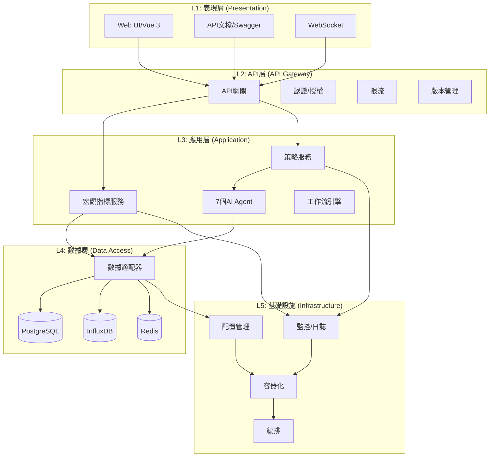
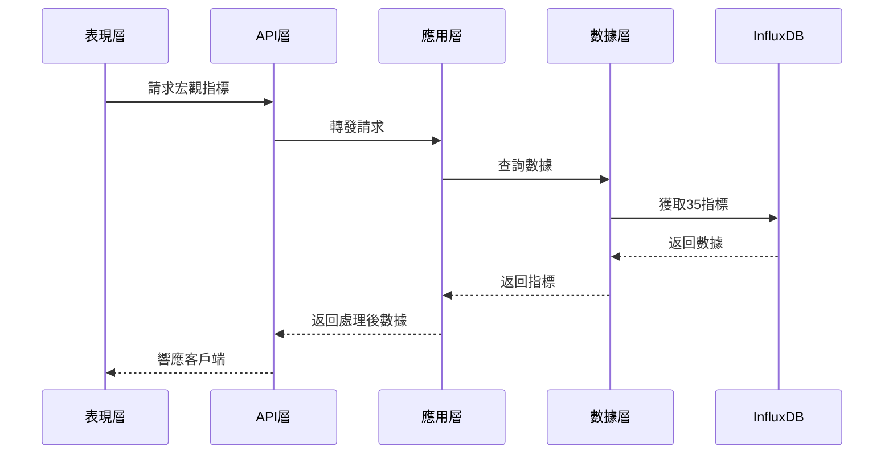
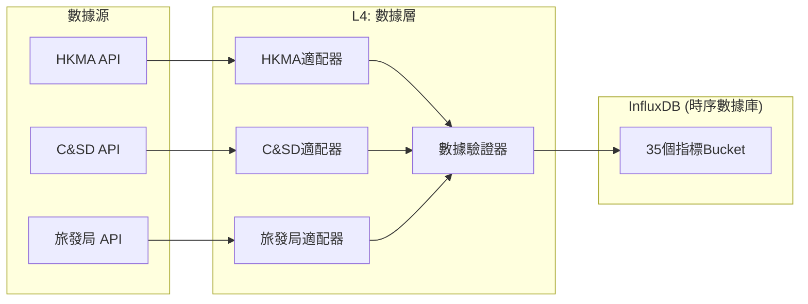

# Mini Hedge Fund Sprint 0 - 5層架構設計

**版本**: v1.0
**創建日期**: 2025年11月5日
**適用範圍**: Sprint 0 - US-002 Task 2.1
**架構版本**: 5層架構 v1.0

---

## 目錄

1. [架構概述](#架構概述)
2. [5層架構設計](#5層架構設計)
3. [層間接口定義](#層間接口定義)
4. [目錄結構映射](#目錄結構映射)
5. [依賴關係](#依賴關係)
6. [遷移計劃](#遷移計劃)
7. [架構圖](#架構圖)

---

## 架構概述

Mini Hedge Fund Sprint 0採用**5層架構**設計，確保系統的可擴展性、可維護性和清晰的職責分離。此架構基於**領域驅動設計(DDD)**原則和**Clean Architecture**理念。

### 設計原則

1. **單一職責**: 每層只負責一種類型的任務
2. **依賴倒置**: 高層不依賴低層，都依賴抽象
3. **閉環設計**: 層間通信形成閉環，無循環依賴
4. **接口隔離**: 層與層之間通過定義良好的接口通信
5. **可替換性**: 每層可以獨立替換和升級

### 核心目標

- ✅ 支持35個宏觀指標的存儲和查詢
- ✅ 支持異步數據獲取和處理
- ✅ 支持多策略引擎協同工作
- ✅ 支持實時風險監控
- ✅ 支持水平擴展

---

## 5層架構設計

### Layer 1: 表現層 (Presentation Layer)

**職責**: 用戶界面和外部交互
**位置**: `src/dashboard/` + `web/`

#### 子模組
```
dashboard/
├── api_routes.py              # API路由定義
├── websocket_manager.py       # WebSocket連接管理
├── agent_control.py          # Agent控制面板
├── performance_service.py    # 性能監控服務
├── macro_data_service.py     # 宏觀指標服務
└── strategy_service.py       # 策略服務
```

#### 核心組件
- **Web UI**: Vue 3 前端界面
- **API文檔**: Swagger/OpenAPI 3.0
- **WebSocket**: 實時數據推送
- **監控面板**: Grafana集成

#### 典型接口
```python
@router.get("/api/macro/indicators")
async def get_macro_indicators():
    """獲取35個宏觀指標"""

@router.post("/api/strategies/generate")
async def generate_trading_signals():
    """生成交易信號"""

@router.get("/ws/risk")
async def risk_monitoring_websocket():
    """風險監控WebSocket"""
```

---

### Layer 2: API層 (API Gateway Layer)

**職責**: 請求路由、認證、限流、API版本管理
**位置**: `src/api/`

#### 子模組
```
api/
├── __init__.py
├── gateway.py                 # API網關
├── auth.py                   # 認證授權
├── rate_limiter.py          # 限流
├── version_manager.py       # 版本管理
├── middleware.py            # 中間件
└── real_data_api.py         # 真實數據API
```

#### 核心組件
- **API Gateway**: 統一入口點
- **認證/授權**: JWT Token驗證
- **限流**: 每秒請求限制
- **版本管理**: v1.0和v2.0並行
- **API文檔**: OpenAPI自動生成

#### 典型接口
```python
class APIGateway:
    """API網關"""

    async def route_request(self, request: Request) -> Response:
        """路由請求到對應服務"""

    async def authenticate(self, token: str) -> User:
        """用戶認證"""

    async def rate_limit(self, user_id: str) -> bool:
        """檢查限流"""

    async def version_compatibility(self, request: Request) -> dict:
        """API版本兼容性檢查"""
```

---

### Layer 3: 應用層 (Application Layer)

**職責**: 業務邏輯編排、工作流、事務管理
**位置**: `src/services/` + `src/agents/`

#### 子模組
```
services/
├── macro_indicator_service.py   # 宏觀指標服務
├── strategy_service.py          # 策略服務
├── risk_service.py             # 風險管理服務
├── portfolio_service.py        # 投資組合服務
├── notification_service.py     # 通知服務
└── workflow_service.py         # 工作流服務

agents/
├── coordinator.py              # Agent協調器
├── base_agent.py              # Agent基類
├── data_scientist.py          # 數據科學家
├── quantitative_analyst.py    # 量化分析師
├── portfolio_manager.py       # 投資組合經理
├── risk_analyst.py            # 風險分析師
└── quantitative_engineer.py   # 量化工程師
```

#### 核心組件
- **MacroIndicatorService**: 35個宏觀指標處理
- **StrategyService**: 3大策略引擎協同
- **RiskService**: 實時風險計算
- **PortfolioService**: 動態資產配置
- **Agent集群**: 7個專業AI智能體

#### 典型接口
```python
class MacroIndicatorService:
    """宏觀指標服務"""

    async def get_latest_indicators(self) -> Dict[str, float]:
        """獲取最新35個指標"""

    async def calculate_oscillator(self, indicators: Dict[str, float]) -> float:
        """計算宏觀振盪器"""

    async def detect_market_regime(self, oscillator: float) -> str:
        """檢測市場狀態"""

    async def get_trading_signals(self, regime: str) -> List[Signal]:
        """獲取交易信號"""

class AgentCoordinator:
    """Agent協調器"""

    async def orchestrate_agents(self, task: Task) -> Result:
        """協調多個Agent執行任務"""

    async def broadcast_message(self, message: Message) -> None:
        """廣播消息給所有Agent"""
```

---

### Layer 4: 數據層 (Data Access Layer)

**職責**: 數據持久化、查詢、緩存、數據適配器
**位置**: `src/data_adapters/` + `src/db/`

#### 子模組
```
data_adapters/
├── base_adapter.py           # 基礎適配器
├── base_real_adapter.py      # 適配器基類(新增)
├── factory.py                # 適配器工廠
├── hkma_adapter.py          # HKMA適配器
├── yahoo_finance_adapter.py # Yahoo Finance
├── hkex_adapter.py          # HKEX適配器
└── validation.py            # 數據驗證

db/
├── postgresql/              # PostgreSQL相關
│   ├── models.py
│   ├── repository.py
│   └── migrations/
├── influxdb/                # InfluxDB相關
│   ├── client.py
│   ├── repository.py
│   └── schema/
└── redis/                   # Redis相關
    ├── client.py
    ├── cache.py
    └── session.py
```

#### 核心組件
- **DataAdapterFactory**: 適配器工廠模式
- **HKMAAdapter**: 5個HIBOR指標適配器
- **PostgreSQLRepo**: 交易數據持久化
- **InfluxDBRepo**: 時間序列數據(35指標)
- **RedisCache**: 緩存層

#### 典型接口
```python
class DataAdapter(ABC):
    """數據適配器基類"""

    @abstractmethod
    async def fetch_data(self, symbol: str, start_date: str, end_date: str) -> DataFrame:
        """獲取數據"""

    @abstractmethod
    async def validate_data(self, data: DataFrame) -> bool:
        """驗證數據"""

class HKMAAdapter(DataAdapter):
    """HKMA數據適配器"""

    async def fetch_hibor_data(self) -> Dict[str, float]:
        """獲取5個HIBOR指標"""

    async def get_historical_data(self, days: int) -> DataFrame:
        """獲取歷史HIBOR數據"""

class PostgreSQLRepository:
    """PostgreSQL數據庫操作"""

    async def save_trade_record(self, record: TradeRecord) -> None:
        """保存交易記錄"""

    async def get_portfolio_data(self, user_id: str) -> Portfolio:
        """獲取投資組合數據"""

class InfluxDBRepository:
    """InfluxDB時序數據庫操作"""

    async def save_macro_indicators(self, indicators: Dict[str, float]) -> None:
        """保存宏觀指標"""

    async def query_indicators(self, start_time: str, end_time: str) -> DataFrame:
        """查詢指標時間序列"""
```

---

### Layer 5: 基礎設施層 (Infrastructure Layer)

**職責**: 外部服務、配置、日誌、監控、容器化
**位置**: `src/config/` + `src/utils/` + `docker/`

#### 子模組
```
config/
├── database.py              # 數據庫配置
├── redis.py                 # Redis配置
├── influxdb.py              # InfluxDB配置
├── logging.py              # 日誌配置
└── settings.py             # 應用設置

utils/
├── logger.py               # 日誌工具
├── monitor.py              # 監控工具
├── performance.py          # 性能監控
├── security.py             # 安全工具
└── helpers.py              # 輔助函數

infrastructure/
├── docker/                  # Docker配置
│   ├── Dockerfile
│   ├── docker-compose.yml
│   └── .dockerignore
├── k8s/                     # Kubernetes配置
│   ├── deployment.yaml
│   ├── service.yaml
│   └── configmap.yaml
└── monitoring/              # 監控配置
    ├── prometheus.yml
    ├── grafana/
    └── alerts/
```

#### 核心組件
- **配置管理**: 環境變量、配置文件
- **容器化**: Docker、Kubernetes
- **監控**: Prometheus、Grafana
- **日誌**: 結構化日誌、ELK棧
- **安全**: 認證、授權、加密

#### 典型接口
```python
class Settings(BaseSettings):
    """應用配置"""

    # 數據庫配置
    POSTGRES_URL: str
    INFLUXDB_URL: str
    REDIS_URL: str

    # API配置
    API_HOST: str = "0.0.0.0"
    API_PORT: int = 8001

    # 外部服務
    HKMA_API_KEY: Optional[str] = None
    TELEGRAM_BOT_TOKEN: Optional[str] = None

    class Config:
        env_file = ".env"

class DatabaseManager:
    """數據庫管理器"""

    async def create_connections(self) -> None:
        """創建數據庫連接"""

    async def close_connections(self) -> None:
        """關閉數據庫連接"""

class MonitoringService:
    """監控服務"""

    async def record_metric(self, name: str, value: float) -> None:
        """記錄指標"""

    async def send_alert(self, message: str, severity: str) -> None:
        """發送告警"""
```

---

## 層間接口定義

### L1 → L2: HTTP/REST + WebSocket

```python
# 表現層調用API層
class PresentationToAPI:
    async def call_api_v2(self, endpoint: str, data: dict) -> Response:
        gateway = APIGateway()
        return await gateway.route_request(endpoint, data)
```

### L2 → L3: 同步調用 + 消息隊列

```python
# API層調用應用層
class APIToApplication:
    async def generate_signals(self, symbol: str) -> List[Signal]:
        strategy_service = StrategyService()
        return await strategy_service.generate(symbol)
```

### L3 → L4: Repository Pattern

```python
# 應用層調用數據層
class ApplicationToData:
    async def get_indicators(self) -> Dict[str, float]:
        repository = InfluxDBRepository()
        return await repository.get_latest_indicators()
```

### L4 → L5: Driver Pattern

```python
# 數據層使用基礎設施
class DataToInfrastructure:
    async def save_data(self, data: dict) -> None:
        client = InfluxDBClient(settings.INFLUXDB_URL)
        await client.write_data(data)
```

---

## 目錄結構映射

| 層級 | 目錄 | 主要職責 |
|------|------|----------|
| **表現層** | `src/dashboard/` | UI、API路由、WebSocket |
| **API層** | `src/api/` | 認證、路由、限流、版本管理 |
| **應用層** | `src/services/`, `src/agents/` | 業務邏輯、Agent協調、工作流 |
| **數據層** | `src/data_adapters/`, `src/db/` | 數據適配器、Repository、緩存 |
| **基礎設施** | `src/config/`, `src/utils/` | 配置、監控、容器化、日誌 |

---

## 依賴關係

### 層間依賴 (单向依賴)

```
表現層 → API層 → 應用層 → 數據層 → 基礎設施
   ↑                                            ↓
   └──────────────────────────依賴抽象─────────────────────────┘
```

### 詳細依賴圖

```
L1: 表現層
├── 依賴 → L2: API層 (HTTP協議)
│
└── 被L2依賴 ← L2: API層

L2: API層
├── 依賴 → L3: 應用層 (同步調用)
│
└── 被L3依賴 ← L3: 應用層

L3: 應用層
├── 依賴 → L4: 數據層 (Repository模式)
│
└── 被L4依賴 ← L4: 數據層

L4: 數據層
├── 依賴 → L5: 基礎設施 (Driver模式)
│
└── 被L5依賴 ← L5: 基礎設施

L5: 基礎設施
├── 提供抽象給所有上層
│
└── 不依賴任何上層
```

### 依賴規則

1. **禁止自上而下的直接依賴**: 高層不能直接導入低層模組
2. **通過抽象依賴**: 使用接口、抽象類、協議
3. **依賴注入**: 通過構造函數或依賴注入容器
4. **消息隊列**: 跨層通信優先使用異步消息

---

## 遷移計劃

### 階段1: 創建新目錄結構

```bash
# 創建5層架構目錄
mkdir -p src/{api,services,db/{postgresql,influxdb,redis},config,utils}

# 移動現有代碼到對應層
mv src/dashboard/api_routes.py src/api/
mv src/data_adapters src/db/adapters
mv src/agents src/services/agents
```

### 階段2: 定義抽象接口

```python
# src/core/interfaces.py
from abc import ABC, abstractmethod

class IMacroIndicatorService(ABC):
    @abstractmethod
    async def get_indicators(self) -> Dict[str, float]:
        pass

class IDataAdapter(ABC):
    @abstractmethod
    async def fetch_data(self, symbol: str) -> DataFrame:
        pass
```

### 階段3: 實現層間通信

```python
# src/api/gateway.py
class APIGateway:
    def __init__(self, service_container: ServiceContainer):
        self.macro_service = service_container.get(IMacroIndicatorService)

    async def handle_request(self, request: Request):
        indicators = await self.macro_service.get_indicators()
        return JSONResponse(indicators)
```

### 階段4: 測試驗證

```bash
# 運行層間集成測試
pytest tests/layer_integration/ -v

# 驗證依賴關係
pylint --dependency-graph=src/
```

### 階段5: 文檔更新

- 更新README.md
- 更新API文檔
- 更新部署指南

---

## 架構圖

### 系統架構圖



### 數據流圖



### 宏觀指標數據流



---

## 關鍵設計決策

### 1. 為什麼選擇5層架構？

**問題**: 現有系統代碼耦合度高，難以維護和測試
**解決方案**: 分層解耦，每層職責清晰
**收益**:
- 提高代碼可測試性
- 降低耦合度
- 提升可維護性
- 支持獨立部署

### 2. 為什麼使用Repository模式？

**問題**: 數據訪問邏輯分散在業務層
**解決方案**: 封裝數據訪問為Repository
**收益**:
- 業務層與數據層隔離
- 便於單元測試
- 支持多種數據源
- 統一的數據訪問接口

### 3. 為什麼使用依賴注入？

**問題**: 硬編碼依賴導致難以替換
**解決方案**: 通過構造函數注入依賴
**收益**:
- 降低耦合度
- 提高可測試性
- 支持熱插拔
- 符合SOLID原則

### 4. 為什麼選擇異步架構？

**問題**: 同步調用導致性能瓶頸
**解決方案**: 使用asyncio實現異步處理
**收益**:
- 提高並發性能
- 降低資源占用
- 更好的用戶體驗
- 適合I/O密集型應用

---

## 性能指標

### 吞吐量目標

| 層級 | 指標 | 目標值 |
|------|------|--------|
| API層 | QPS | 1000+ |
| 應用層 | 請求延遲 | <100ms (P95) |
| 數據層 | 查詢延遲 | <50ms (P95) |
| 整體 | 端到端延遲 | <200ms (P95) |

### 可用性目標

- **系統可用性**: 99.9% (年停機時間 < 8.76小時)
- **數據一致性**: 100% (關鍵業務數據)
- **故障恢復**: <5分鐘 (自動恢復)

---

## 下一步計劃

1. ✅ 完成5層架構設計
2. 🔄 創建新的目錄結構
3. 🔄 定義抽象接口
4. 🔄 實現層間通信
5. 🔄 運行集成測試
6. 🔄 更新文檔

---

**文檔版本**: v1.0
**最後更新**: 2025年11月5日
**維護者**: Mini Hedge Fund架構團隊
